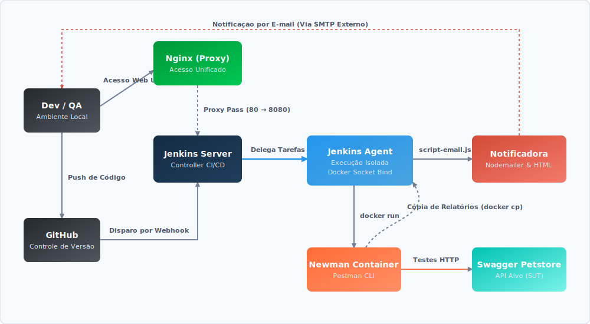
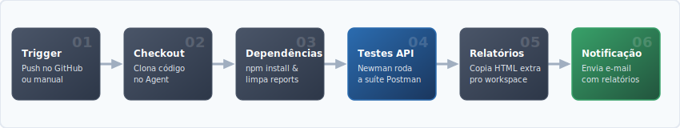

# 🐾 Petstore API Testing Suite

Este projeto contém uma suíte de testes automatizados para a **Swagger Petstore API**, desenvolvido como parte da disciplina de **Qualidade e Gerência de Software** no INATEL. O foco principal é validar os fluxos de sucesso (Happy Path) e comportamentos de erro (Negative Path) utilizando **Postman** e **Newman**.

Além da automação dos testes, o projeto utiliza uma infraestrutura baseada em **Docker**, **Jenkins** e **Nginx** para implementar práticas de **Integração Contínua e Entrega Contínua (CI/CD)**.

---

## 👥 Equipe

* **André Augusto** - https://github.com/andreaugust0
* **Arthur Rabelo** - https://github.com/arthurrabeloo
* **Marcus Vinicius** - https://github.com/MarcusSouza02
* **Kaik Freitas** - https://github.com/kafreitas07
* **Dimitri Schulz** - https://github.com/schulzdimitri
* **Anna Rennó** - https://github.com/acrenno

---

## 🤖 Uso de Inteligência Artificial

Este projeto utilizou tecnologias de **Inteligência Artificial (IA)** como ferramenta de apoio e co-criação. O uso de modelos de linguagem avançados (como o Google Gemini) foi aplicado nas seguintes frentes:

* Geração de Scripts.
* Documentação.
* Planejamento de Testes.
* Containerização e Infraestrutura.
* Pipeline CI/CD.

> Todos os artefatos gerados por IA foram revisados, testados e validados pelos integrantes do grupo para garantir a precisão técnica e o cumprimento dos requisitos acadêmicos.

### 💬 Exemplos de Prompts Utilizados

<details>
<summary>🐳 Containerização e Infraestrutura</summary>

**Contexto:** Dúvida sobre o motivo do Jenkins Agent necessitar da instalação do Docker CLI internamente.
> **Prompt:** *"Porque na imagem do agent temos que baixar o docker?"*

</details>

<details>
<summary>💻 Pair Programming e Mentoria</summary>

**Contexto:** Solicitação de refatoração de código com explicação técnica detalhada sobre a resolução de caminhos de arquivos relativos no Jenkins Agent.
> **Prompt:** *"Refatore o script de e-mail para enviar feedbacks dinâmicos de sucesso/falha e explique por que os anexos dos relatórios do Newman não estavam sendo encontrados pelo script durante a execução da pipeline."*

</details>

<details>
<summary>🌐 Proxy Reverso e Redirecionamento (Nginx)</summary>

**Contexto:** Entendimento da necessidade arquitetural e benefícios práticos de se utilizar um proxy reverso para expor a interface do Jenkins.
> **Prompt:** *"Pra que serve o nginx nesse projeto? Explique detalhadamente como o proxy reverso facilita o acesso local e como isso se aplica a ambientes de produção reais."*

</details>

---

## 🛠️ Tecnologias Utilizadas

* Postman - Criação e design dos testes.
* Node.js - Ambiente de execução para o Newman.
* Newman - Runner de linha de comando para testes do Postman.
* Newman-Reporter-HtmlExtra - Gerador de relatórios visuais em HTML.
* Swagger Petstore - API alvo (System Under Test).
* Docker - Containerização dos serviços.
* Docker Compose - Orquestração dos containers.
* Jenkins - Automação da pipeline CI/CD.
* Nginx - Proxy reverso para acesso ao Jenkins.

---

## 🐳 Containerização com Docker

Toda a infraestrutura do projeto foi containerizada utilizando Docker e Docker Compose, garantindo portabilidade, padronização do ambiente e facilidade de implantação.

### Serviços Utilizados

| Serviço       | Responsabilidade                     |
| ------------- | ------------------------------------ |
| Jenkins       | Execução da pipeline CI/CD           |
| Jenkins Agent | Execução das etapas automatizadas    |
| Nginx         | Proxy reverso para acesso ao Jenkins |
| Newman        | Execução dos testes automatizados    |

### Imagem no Docker Hub

A imagem do Jenkins (com Node.js, Docker CLI e os plugins do `jenkins/plugins.txt` já instalados via `Dockerfile.jenkins`) está publicada publicamente no Docker Hub:

🔗 **[kaikfreitas/s07-jenkins](https://hub.docker.com/r/kaikfreitas/s07-jenkins)**

Ela é referenciada diretamente no `docker-compose.yml` (`image: kaikfreitas/s07-jenkins:latest`) e baixada automaticamente ao rodar `docker compose up`.

### Arquitetura da Solução

<div align="center">
  <table>
    <tr>
      <td>
        
      </td>
    </tr>
  </table>
</div>

## 🚀 Como executar o projeto:

### Inicialização dos Containers

Subir todos os serviços (com rebuild):

```bash
docker compose up -d --build
```

Verificar containers em execução:

```bash
docker ps
```

Visualizar logs:

```bash
docker compose logs -f
```

Encerrar os serviços:

```bash
docker compose down
```

---

## ⚙️ Pipeline CI/CD

O projeto utiliza uma pipeline declarativa implementada no Jenkins para automatizar a validação da API.

### Fluxo da Pipeline

<div align="center">
  <table>
    <tr>
      <td>
        
      </td>
    </tr>
  </table>
</div>


### Integração Contínua

A pipeline pode ser executada automaticamente a cada novo push realizado no repositório GitHub, permitindo validação contínua e identificação rápida de falhas.

---

## 📋 Pré-requisitos

Antes de começar, você precisará ter instalado em sua máquina:

1. Node.js (versão 12 ou superior).
2. npm (gerenciador de pacotes do Node).

---

## 📊 Estrutura de Testes

A suíte está organizada em 21 Casos de Teste (TC) seguindo o padrão de identificação única:

* TC-001 a TC-010: Caminhos Felizes (Happy Path).
* TC-011 a TC-021: Caminhos Negativos (Negative Path).

Todos os testes utilizam variáveis de ambiente para garantir independência entre execuções e facilitar a manutenção dos cenários.
